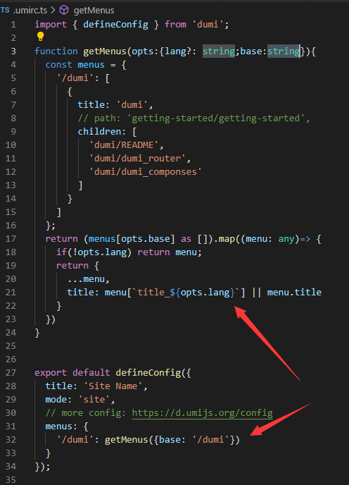

## 统一配置
<Alert type="info">在配置文件`.umirc.ts` 中配置</Alert>


> 效果：<br/>
> <span style="color:white">占位子</span>即本页面左侧菜单，dumi为1，其下面几个2级菜单

## 单独设置
1. 在文件夹docs下新建一个文件夹，为blog
2. 这个blog会在首页的右上角导航栏菜单中显示，显示标题在 `README.md` / `index.md`头部设置
```js
---
title: blog_a
order: 0
nav:
    title: 'HBlog'
    order: 2
---
```
3. 如上，`title`和`order`是文档中属性，nav 中才是 2 中导航栏菜单的设置属性（标题名和从左到右的排序）
4. 这种设置需要写到 `---` 中，且放到md内容最顶部

## 左侧菜单路由
例如本页中路由下面三个2级菜单，他们本质不是三个页面，而是在同一个页面中!<br/>
要达到这种效果，两步即可:
1. 页面中合理运用`#`~`######`，根据内容编排好
2. 在顶部的`---`中添加设置`toc: menu`即可
<Alert type="warning">如果不需要左侧菜单，默认这种菜单结构会被显示到右侧，变成结构树展示，例如`入门`页面</Alert>
